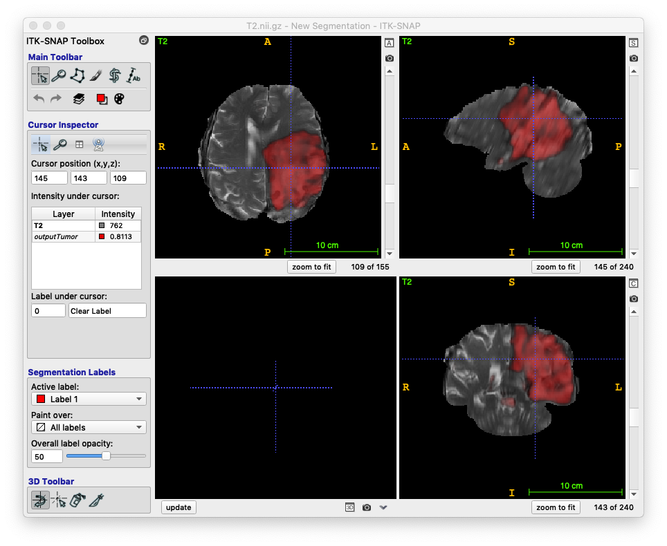

# App:  Whole brain tumor segmentation

Deep learning app made for MRI (T2 + FLAIR) brain tumor segmentation using ANTsRNet

## Prerequisites

* [R](https://www.r-project.org) installation
* [ANTsR](https://github.com/ANTsX/ANTsR) installation
* [ANTsRNet](https://github.com/ANTsX/ANTsRNet) installation

## Model training notes

* Training data: BRATS 2014
* Unet model (see ``Scripts/Training/``).
* Template-based data augmentation

## Sample prediction usage

```
#
#  Usage:
#    Usage:  Rscript doWholeTumorSegmentation.R inputMod1File inputMod2File ... inputMaskFile outputFilePrefix reorientationTemplate
#
#  MacBook Pro 2016 (no GPU)
#

$ Rscript Scripts/doWholeTumorSegmentation.R Data/Example/brats_tcia_pat222_2/T2.nii.gz Data/Example/brats_tcia_pat222_2/Flair.nii.gz Data/Example/brats_tcia_pat222_2/BrainExtractionMask.nii.gz output Data/Template/S_template3_resampled2.nii.gz 

*** Successfully loaded .Rprofile ***

Loading required package: ANTsRCore

Attaching package: ‘ANTsRCore’

The following object is masked from ‘package:stats’:

var

The following objects are masked from ‘package:base’:

all, any, apply, max, min, prod, range, sum

Reading reorientation template Data/Template/S_template3_resampled2.nii.gz  (elapsed time: 0.109899 seconds)
Using TensorFlow backend.
Loading weights filetrying URL 'https://ndownloader.figshare.com/files/14087045'
Content type 'application/octet-stream' length 22470024 bytes (21.4 MB)
==================================================
downloaded 21.4 MB

(elapsed time: 11.98142 seconds)
Reading input.  (elapsed time: 0.506922 seconds)
Normalizing to template and cropping to mask.  (elapsed time: 1.514897 seconds)
Prediction and decoding (elapsed time: 11.90053 seconds)
Renormalize to native space  (elapsed time: 0.818454 seconds)
Writing output  (elapsed time: 1.807848 seconds)

Total elapsed time: 16.55196 seconds
```

## Sample results


